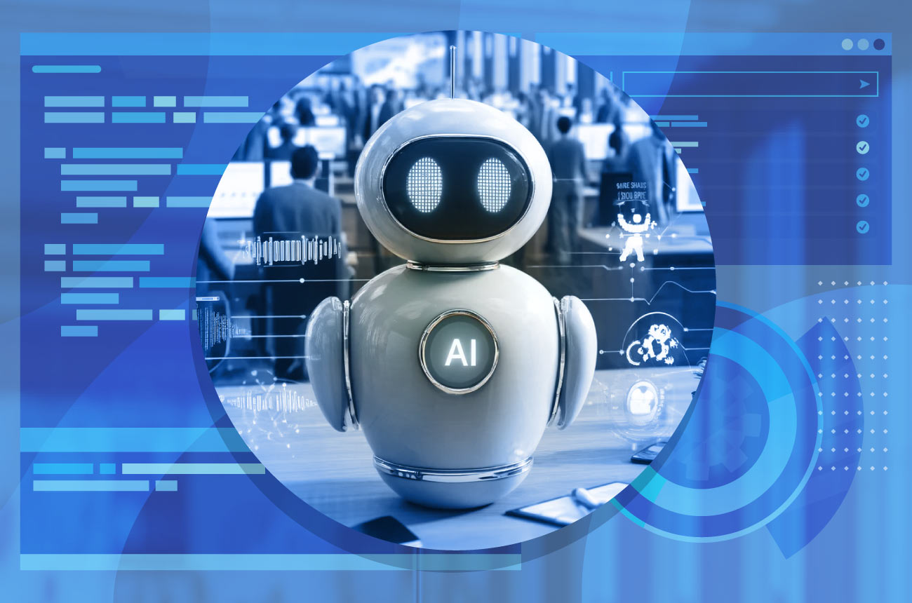

  

---

# Principles and Engineering Applications of AI - Course Assignments

This repository contains my assignments completed for the course *18-662: Principles and Engineering Applications of AI* during Spring 2025 at Carnegie Mellon University. The repo includes homework sets and potentially components of a research project, showcasing my work on applying AI principles to engineering challenges.

## Repository Purpose

The assignments here reflect my efforts to solve problems and implement concepts from the course, focusing on both theoretical foundations and practical applications of AI. They include Python-based coding exercises from the homework sets and may feature contributions to a research project exploring real-world engineering applications of AI.

## Course Overview

*18-662: Principles and Engineering Applications of AI* is a graduate-level course that explores the foundational principles of Artificial Intelligence and their applications in engineering contexts. The course combines theoretical lectures with hands-on projects, covering a broad spectrum of AI topics and their practical implementations. Below is a summary of the key topics covered:

### Topics Covered
- **Intelligent Agents**: Single-agent and multi-agent systems (MAS), problem-solving with search (informed, adversarial, constraint satisfaction).
- **Planning and Decision Making**:
  - Planning in AI.
  - Decision-making under uncertainty with probabilistic reasoning.
  - Bayesian networks, Hidden Markov Models (HMM), Kalman filtering, and Dynamic Bayesian Networks.
  - Markov Chain Monte Carlo (MCMC) algorithms.
- **Machine Learning**:
  - Statistical learning (Bayesian and MAP learning).
  - Neural networks (ANNs), convolutional neural networks (CNNs), and deep learning.
  - Expectation Maximization (EM) algorithm.
- **Perception and Interaction**:
  - Basics of computer vision.
  - Natural Language Processing (NLP) and speech recognition.
- **Robotics**: Principles and applications in autonomous systems.
- **Engineering Applications** (via Research Projects):
  - Autonomous driving and robotics (e.g., drones, UAVs).
  - Traffic management, finance, economics, and medical applications.
  - Patent litigation automation, video games, military, art, and advertising.
  - Generative AI (GANs, GPT), foundation models, and time series analysis.
  - Responsible AI, bias elimination, sustainable AI, and AI in quantum computing.

The course emphasizes hands-on learning through coding assignments and a research project addressing cutting-edge engineering problems.

## Prerequisites

To succeed in this course and understand the assignments in this repository, the following background is required:
- Strong foundation in basic probability theory.
- Maturity in mathematical topics (e.g., linear algebra, calculus).
- Good programming skills (preferably in Python).
- For seniors without these prerequisites, instructor permission is needed.

## Course Resources

- **Required Textbook**: *Artificial Intelligence: A Modern Approach, 3rd Edition* by Stuart Russell and Peter Norvig (Prentice Hall).
- **Recommended Readings**:
  - *Pattern Recognition and Machine Learning* by Christopher M. Bishop (Springer, 2006).
  - *Deep Learning* by Ian Goodfellow, Yoshua Bengio, and Aaron Courville (MIT Press, 2016).
  - *Deep Learning: Foundations and Concepts* by Christopher M. Bishop and Hugh Bishop (Springer, 2023).
- **Suggested Readings**:
  - *Probability and Random Processes for Electrical Engineering* by A. Leon-Garcia (Prentice Hall, 1993).
  - *Probability, Random Variables and Stochastic Processes, 4th Edition* by A. Papoulis and S. U. Pillai (McGraw Hill, 2002).

## Assignment Context

The assignments in this repo include:
- **Homework Sets**: Five sets of problems requiring Python coding to explore topics like search algorithms, probabilistic reasoning, and neural networks.
- **Research Project (Potential)**: Contributions to a team-based project investigating an engineering application of AI, involving literature review, hypothesis development, methodology (analysis/simulations/experiments), and results, culminating in a technical report and presentation.

These assignments bridge theoretical AI concepts with practical engineering solutions, offering a glimpse into the power and challenges of AI in real-world contexts.

Feel free to explore the code and solutions to see how these ideas are implemented!

---